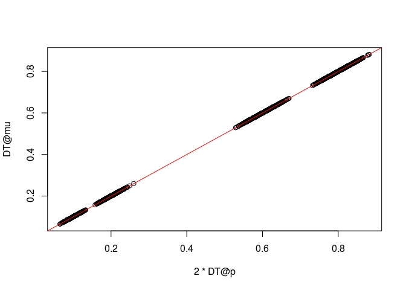
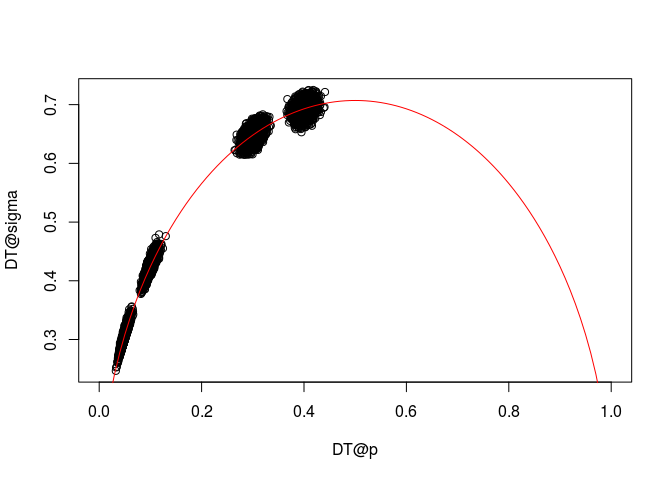
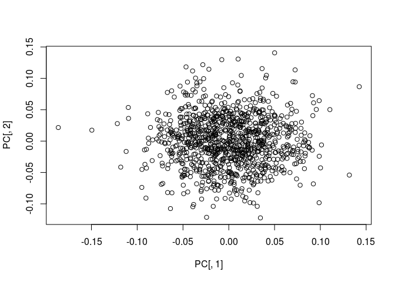

# Fitting Linear Mixed Model


## Load Packages


```r
# install.packages("gaston")
library(gaston)
```


## Set Simulation Parameters


```r
# number of subjects
n <- 1000

# number of genotypes
p <- 1e4

# number of causal genotypes
p_causal <- 50

# Signal to noise ratio
signal_to_noise_ratio <- 2

# vector of allele frequencies from which to sample
probs <- c(0.05, 0.1, 0.3, 0.4)
```

## Generate Sample Data with Missing Genotypes


```r
set.seed(345321)
geno <- replicate(p, rbinom(n, 2, sample(probs, 1)))
dim(geno)
```

```
## [1]  1000 10000
```

```r
geno[1:5,1:5]
```

```
##      [,1] [,2] [,3] [,4] [,5]
## [1,]    0    0    1    1    0
## [2,]    1    0    0    1    0
## [3,]    1    1    0    0    0
## [4,]    2    1    1    0    0
## [5,]    1    2    1    0    0
```

```r
geno[sample(1:p, 100)] <- NA
geno[1:5,1:5]
```

```
##      [,1] [,2] [,3] [,4] [,5]
## [1,]    0    0    1    1    0
## [2,]    1    0    0    1    0
## [3,]    1    1    0    0    0
## [4,]    2    1    1    0    0
## [5,]    1    2    1    0    0
```


## Convert to BED Matrix

This is so that we can use the functions in the `gaston` package for fitting mixed models


```r
DT <- gaston::as.bed.matrix(geno)

# can access the data by 
as.matrix(DT)[1:5, 1:5]
```

```
##   M_1 M_2 M_3 M_4 M_5
## 1   0   0   1   1   0
## 2   1   0   0   1   0
## 3   1   1   0   0   0
## 4   2   1   1   0   0
## 5   1   2   1   0   0
```

```r
# see the contents of DT
slotNames(DT)
```

```
## [1] "ped"                  "snps"                 "bed"                 
## [4] "p"                    "mu"                   "sigma"               
## [7] "standardize_p"        "standardize_mu_sigma"
```

```r
# to access the different contents of DT use @ 
DT@snps[1:5,]
```

```
##   chr  id dist pos A1 A2  N0  N1  N2 NAs N0.f N1.f N2.f NAs.f callrate
## 1  NA M_1   NA  NA NA NA 480 411 101   8   NA   NA   NA    NA    0.992
## 2  NA M_2   NA  NA NA NA 349 477 167   7   NA   NA   NA    NA    0.993
## 3  NA M_3   NA  NA NA NA 461 442  85  12   NA   NA   NA    NA    0.988
## 4  NA M_4   NA  NA NA NA 781 200   9  10   NA   NA   NA    NA    0.990
## 5  NA M_5   NA  NA NA NA 886  95   3  16   NA   NA   NA    NA    0.984
##          maf         hz
## 1 0.30897177 0.41431452
## 2 0.40835851 0.48036254
## 3 0.30971660 0.44736842
## 4 0.11010101 0.20202020
## 5 0.05132114 0.09654472
```

```r
DT@ped[1:5,]
```

```
##   famid id father mother sex pheno   N0   N1  N2 NAs N0.x N1.x N2.x NAs.x
## 1     1  1      0      0   0     0 6431 2916 652   1    0    0    0     0
## 2     2  2      0      0   0     0 6450 2873 677   0    0    0    0     0
## 3     3  3      0      0   0     0 6441 2899 660   0    0    0    0     0
## 4     4  4      0      0   0     0 6374 2986 640   0    0    0    0     0
## 5     5  5      0      0   0     0 6339 2978 683   0    0    0    0     0
##   N0.y N1.y N2.y NAs.y N0.mt N1.mt N2.mt NAs.mt callrate    hz callrate.x
## 1    0    0    0     0     0     0     0      0     -Inf -2916        NaN
## 2    0    0    0     0     0     0     0      0      NaN   Inf        NaN
## 3    0    0    0     0     0     0     0      0      NaN   Inf        NaN
## 4    0    0    0     0     0     0     0      0      NaN   Inf        NaN
## 5    0    0    0     0     0     0     0      0      NaN   Inf        NaN
##   hz.x callrate.y hz.y callrate.mt hz.mt
## 1  NaN        NaN  NaN         NaN   NaN
## 2  NaN        NaN  NaN         NaN   NaN
## 3  NaN        NaN  NaN         NaN   NaN
## 4  NaN        NaN  NaN         NaN   NaN
## 5  NaN        NaN  NaN         NaN   NaN
```

```r
# p contains the alternate allele frequency 
# mu is equal to 2*p and is the expected value of the genotype (coded in 0, 1, 2)
# sigma is the genotype standard error
DT@p[1:10]
```

```
##  [1] 0.30897177 0.40835851 0.30971660 0.11010101 0.05132114 0.05393145
##  [7] 0.28556911 0.04984894 0.30502513 0.39635996
```

```r
DT@mu[1:10]
```

```
##  [1] 0.61794355 0.81671702 0.61943320 0.22020202 0.10264228 0.10786290
##  [7] 0.57113821 0.09969789 0.61005025 0.79271992
```

```r
DT@sigma[1:10]
```

```
##  [1] 0.6607853 0.6950724 0.6350671 0.4338020 0.3110142 0.3155285 0.6256291
##  [8] 0.3053246 0.6458457 0.6949752
```

```r
plot(2*DT@p, DT@mu)
abline(a=0,b=1, col = "red")
```

<!-- -->

If the Hardy-Weinberg equilibrium holds, `sigma` should be close to $\sqrt{2*p(1-p)}$. This is illustrated on the figure below


```r
plot(DT@p, DT@sigma, xlim=c(0,1))
t <- seq(0,1,length=101);
lines(t, sqrt(2*t*(1-t)), col="red")
```

<!-- -->

## Standardized SNP matrix


```r
# this will center the columns of DT to mean 0, and standard deviation sqrt(2p(1-p))
gaston::standardize(DT) <- "p"
X <- as.matrix(DT)
X[1:5, 1:5]
```

```
##          M_1        M_2        M_3        M_4      M_5
## 1 -0.9456415 -1.1749151  0.5819959  1.7615748 -0.32893
## 2  0.5846625 -1.1749151 -0.9472912  1.7615748 -0.32893
## 3  0.5846625  0.2636678 -0.9472912 -0.4974395 -0.32893
## 4  2.1149665  0.2636678  0.5819959 -0.4974395 -0.32893
## 5  0.5846625  1.7022506  0.5819959 -0.4974395 -0.32893
```

## Dealing With Missing Values

In standardized matrices, the `NA` values are replaced by zeroes, which amount to impute the missing genotypes by the mean genotype.


```r
X[is.na(X)] <- 0
X[1:5,1:5]
```

```
##          M_1        M_2        M_3        M_4      M_5
## 1 -0.9456415 -1.1749151  0.5819959  1.7615748 -0.32893
## 2  0.5846625 -1.1749151 -0.9472912  1.7615748 -0.32893
## 3  0.5846625  0.2636678 -0.9472912 -0.4974395 -0.32893
## 4  2.1149665  0.2636678  0.5819959 -0.4974395 -0.32893
## 5  0.5846625  1.7022506  0.5819959 -0.4974395 -0.32893
```

The object `X` is what will be used as the data matrix in the LMM analysis. We also need to create the kinship matrix, which we do next.


## Calculate Kinship Matrix

If $X_s$ is a standardized $n \times p$ matrix of genotypes, a Genetic Relationship Matrix of individuals can be computed as \[GRM = \frac{1}{p-1} X_s X_s^\top\] where $p$ is the number of SNPs and $n$ is the number of individuals. This computation is done by the `gaston::GRM` function. Note that we could also use 


```r
(1 / (p - 1)) * tcrossprod(X)
```

to calculate the kinship (covariance) matrix, but the `gaston::GRM` function is faster.  

Note that the `gaston::GRM` function internally standardizes the genotype data, which is why we provide it the object `DT`. The object `X` will be used for fitting the model. We specify `autosome.only = FALSE` because we don't have that information.


```r
kin <- gaston::GRM(DT, autosome.only = FALSE)
kin[1:5,1:5]
```

```
##              1            2             3             4             5
## 1  0.994037390 -0.020637164 -2.610047e-03  1.937922e-02 -0.0050506615
## 2 -0.020637164  0.970255971  1.689422e-03 -1.211568e-02  0.0014872842
## 3 -0.002610047  0.001689422  9.864578e-01 -9.975582e-05  0.0006858376
## 4  0.019379225 -0.012115683 -9.975582e-05  9.979130e-01  0.0061614369
## 5 -0.005050662  0.001487284  6.858376e-04  6.161437e-03  1.0134803057
```


## Principal Components

From the GRM, we can compute the Principal components. The eigenvectors are normalized. The Principal Components (PC) can be computed by multiplying them by the square root of the associated eigenvalues


```r
eiK <- eigen(kin)

# deal with a small negative eigen value
eiK$values[ eiK$values < 0 ] <- 0

PC <- sweep(eiK$vectors, 2, sqrt(eiK$values), "*")
dim(PC)
```

```
## [1] 1000 1000
```

```r
plot(PC[,1], PC[,2])
```

<!-- -->


## Simulate Phenotype

`p_causal` SNPs are randomly assigned to a Uniform(0.9,1.1) distribution. 


```r
beta <- rep(0, p)
beta[sample(1:p, p_causal)] <- runif(p_causal, min = 0.9, max = 1.1)

y.star <- X %*% beta 

error <- stats::rnorm(n)

k <- as.numeric(sqrt(stats::var(y.star)/(signal_to_noise_ratio*stats::var(error))))

Y <- y.star + k*error
```


## Run Univariate LMM

There are two packages we can use to fit uni/multivariate LMMs.

### `gaston` package


```r
# make design matrix with intercept
x1 <- cbind(1, X[,1,drop=FALSE])

# with 1 random effect this function is faster than lmm.aireml
# in gaston::lmm.diago you provide the eigen decomposition 
# in gaston::lmm.aireml you provide the kinship matrix
fit <- gaston::lmm.diago(Y, x1, eigenK = eiK)
```

```
## Optimization in interval [0, 1]
## Optimizing with p = 0
## [Iteration 1] Current point = 0 df = 28.579
## [Iteration 2] Current point = 0.54494 df = 2.00363
## [Iteration 3] Current point = 0.585132 df = -0.018836
## [Iteration 4] Current point = 0.584762 df = -1.81023e-06
```

```r
# equivalently you can also fit using 
# fit <- gaston::lmm.aireml(Y, x1, K = kin, verbose = FALSE)

# the second coefficient is x1, the first is the intercept
(z_score <- fit$BLUP_beta[2]/sqrt(fit$varbeta[2,2]))
```

```
## [1] 0.4642883
```

```r
# pvalue
2*pnorm(z_score, lower.tail = F)
```

```
## [1] 0.6424412
```

```r
# random effect variance
fit$tau
```

```
## [1] 44.29653
```

```r
# error variance
fit$sigma2
```

```
## [1] 31.45491
```

```r
# error sd
sqrt(fit$sigma2)
```

```
## [1] 5.608468
```


### `coxme` package


```r
# install.packages("coxme")
library(coxme)

# need an ID variable
dat <- data.frame(Y, x=X[,1], id = 1:n)

# provide the kinship matrix 
gfit1 <- lmekin(Y ~ x + (1|id), data=dat, varlist=kin)
gfit1
```

```
## Linear mixed-effects kinship model fit by maximum likelihood
##   Data: dat 
##   Log-likelihood = -3572.846 
##   n= 1000 
## 
## 
## Model:  Y ~ x + (1 | id) 
## Fixed coefficients
##                 Value Std Error    z     p
## (Intercept) 0.3185476 0.1720343 1.85 0.064
## x           0.1320349 0.2748453 0.48 0.630
## 
## Random effects
##  Group Variable Std Dev   Variance 
##  id    Vmat.1    6.790932 46.116756
## Residual error= 5.440202
```


## Session Info


```
##  setting  value                       
##  version  R version 3.4.1 (2017-06-30)
##  system   x86_64, linux-gnu           
##  ui       X11                         
##  language en_US                       
##  collate  en_US.UTF-8                 
##  tz       Canada/Eastern              
##  date     2017-10-12                  
## 
##  package      * version date       source                          
##  backports      1.1.0   2017-05-22 cran (@1.1.0)                   
##  base         * 3.4.1   2017-07-08 local                           
##  bdsmatrix    * 1.3-2   2014-08-22 CRAN (R 3.4.1)                  
##  compiler       3.4.1   2017-07-08 local                           
##  coxme        * 2.2-5   2015-06-15 CRAN (R 3.4.1)                  
##  datasets     * 3.4.1   2017-07-08 local                           
##  devtools       1.13.3  2017-08-02 CRAN (R 3.4.1)                  
##  digest         0.6.12  2017-01-27 CRAN (R 3.4.1)                  
##  evaluate       0.10.1  2017-06-24 cran (@0.10.1)                  
##  gaston       * 1.5     2017-05-25 CRAN (R 3.4.1)                  
##  graphics     * 3.4.1   2017-07-08 local                           
##  grDevices    * 3.4.1   2017-07-08 local                           
##  grid           3.4.1   2017-07-08 local                           
##  htmltools      0.3.6   2017-04-28 cran (@0.3.6)                   
##  knitr          1.17    2017-08-10 cran (@1.17)                    
##  lattice        0.20-35 2017-03-25 CRAN (R 3.3.3)                  
##  magrittr       1.5     2014-11-22 CRAN (R 3.4.1)                  
##  Matrix         1.2-11  2017-08-16 CRAN (R 3.4.1)                  
##  memoise        1.1.0   2017-04-21 CRAN (R 3.4.1)                  
##  methods      * 3.4.1   2017-07-08 local                           
##  nlme           3.1-131 2017-02-06 CRAN (R 3.4.0)                  
##  Rcpp         * 0.12.12 2017-07-15 CRAN (R 3.4.1)                  
##  RcppParallel * 4.3.20  2016-08-16 CRAN (R 3.4.1)                  
##  rmarkdown      1.6     2017-06-15 CRAN (R 3.4.1)                  
##  rprojroot      1.2     2017-01-16 CRAN (R 3.4.1)                  
##  splines        3.4.1   2017-07-08 local                           
##  stats        * 3.4.1   2017-07-08 local                           
##  stringi        1.1.5   2017-04-07 CRAN (R 3.4.1)                  
##  stringr        1.2.0   2017-02-18 CRAN (R 3.4.1)                  
##  survival     * 2.41-3  2017-04-04 CRAN (R 3.4.0)                  
##  tools          3.4.1   2017-07-08 local                           
##  utils        * 3.4.1   2017-07-08 local                           
##  withr          2.0.0   2017-09-18 Github (jimhester/withr@d1f0957)
##  yaml           2.1.14  2016-11-12 cran (@2.1.14)
```

